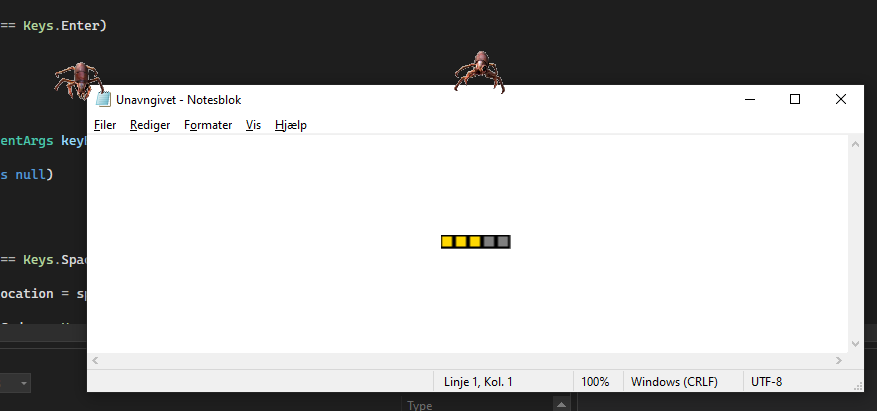

# BiterZergRush
What it feels like to leave biters settings as default. Keep the program open while working on something important ;)

## Project structure
Below is the project explained shortly.

### OverlayEngine
This project handles displaying the entities to the screen, and providing an API for doing so.

 - `IGame`
Provides handy methods tied to the game cycle, such as `OnUpdate` and `OnKeyDown`.

 - `Engine`
A static class for handling the actual game cycle, it takes an `IGame`.

 - `Audio`
Provides basic methods for playing audio, using OpenAL and Aud.IO.

 - `OverlayEntity`
Any entity to be shown on screen inherits from this entity and is submitted to the `Engine`-class, via instantiate method.

### BiterZergRushForms
This is the actual game project, which includes factorio resources (audio and spritesheets).

 - `BiterGame`
The core of the game project, it implements the `IGame`-interface and instantiates the initial biters.

 - `FactorioEntity`
The factorio entity inherits from `OverlayEntity`, and provides the entity with a Factorio healthbar.

## Screenshot
